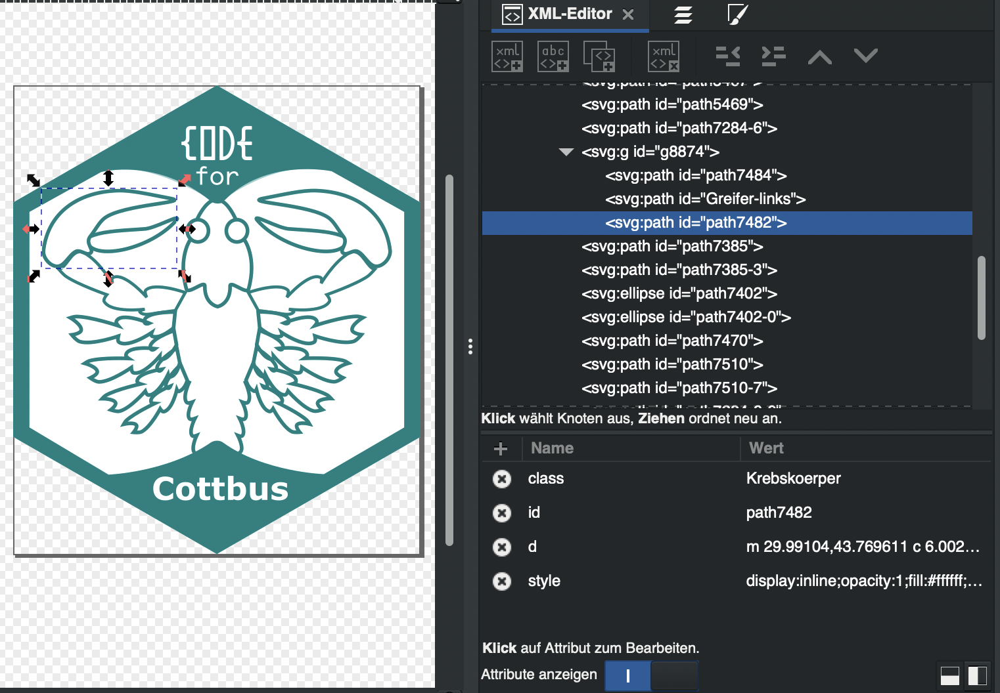

# Logo für das [OKlab Cottbus](https://okdb.cd)

In diesem Repository ist die Gestaltung des [OKlab Cottbus](https://okdb.cd) Logo dokumentiert. Die Grafik wurde in [Inkscape](https://inkscape.org) gestaltet und ist als Quellcode in die Seite eingebettet (siehe [github repository](https://github.com/OK-Lab-Brandenburg/oklab-cottbus)).

## Optimieren der SVG-Datei

Inkscape speichert die eigenen SVG-Dateien mit einer Reihe an Zusatzinformationen, die das Programm intern verwendet. Diese braucht man nicht für die Darstellung auf einer Internetseite. Ausserdem werden die Punkte der Polygone per Default mit sehr hoher Präzision gespeichert. Das kann auf wenige Nachkommastellen begrenzt werden um die SVG-Datei kleiner zu machen.

Mit dem Tool [svgo](https://github.com/svg/svgo) kann die SVG-Datei optimiert und komprimiert werden. Der Befehl dazu lautet: `svgo -i logo.svg -o logo.min.svg`.

Alternativ kann die SVG-Datei auch direkt aus Inkscape heraus in optimierter Form exportiert werden (Inkscape verwendet dazu das Tool [scour](https://github.com/scour-project/scour)). Hierzu wählt man *Datei > Kopie speichern...* und wählt im Dialog "Optimiertes SVG (*.svg)" aus. Nach dem Drücken auf "Speichern" kann man dann unter anderem folgende Optionen auswählen:

- "Anzahl der signifikanten Stellen für Koordinaten" definiert die Präzision der Polygon-Punkte. Hier kann man einiges an Dateigröße sparen, wenn man z.B. nur 4 Nachkommastellen wählt.
- Wenn "Editordaten erhalten" deaktiviert wird, werden alle Informationen aus der Datei entfernt, die nur von Inkscape verwendet werden.
- Die Dateigröße kann weiter reduziert werden wenn unter "SVG-Ausgabe" die Optionen "Metadaten entfernen" und "Kommentare entfernen" aktiviert sind und unter "Optionen" die Option "Farbwerte kürzen".
- Durch die Option "Unbenutze IDs entfernen" werden alle IDs entfernt, die nicht Dateiintern referenziert werden. Dadurch kann die Dateigröße weiter verringert werden. Möchte man bestimmte IDs erhalten (die z.B. über CSS referenziert werden sollen), kann man dies mit der Option "Manuell erstellte IDs, die nicht auf Ziffern enden erhalten" erreichen. Wie man Ids für Elemente in Inkscape setzt ist weiter unten dokumentiert.

## IDs und class-Attribute setzen

Wenn man auf der Webseite Teile einer SVG mit CSS formatieren oder animieren möchte, braucht man entweder IDs für die zu formatierenden/animierenden Elemente oder ein class-Attribut. In Inkscape kann man diese im XML-Editor editieren. Diesen kann man dort einblenden wo man auch den Ebenen-Editor einblendet.

Jedes Element bekommt von Inkscape automatisch eine ID zugewiesen (z.B. `g8874` für eine Gruppe oder  `path7482` für einen Pfad). Diese ID kann jedoch geändert werden. Dazu wählt man das Element mit der Maus aus. Der Editor zeigt automatisch den entsprechenden Knoten. Im unteren Teil des XML-Editors kann dann die ID bearbeitet werden.



Über <kbd>+</kbd> können weitere Attribute zum Knoten hinzugefügt werden. So z.B. das `class`-Attribut zum zuweisen einer oder mehrerer css-Klassen. 

## Viewbox

Die [Viewbox](https://developer.mozilla.org/en-US/docs/Web/SVG/Attribute/viewBox) definiert, wie die in der SVG definierten Koordinaten in Koordinaten auf der Webseite umgerechnet werden. Das `viewBox`-Attribut verwendet vier Werte: `min-x`, `min-y`, `width` und `height`. Diese difnieren die Grenzen der viewBox. Setzt man diese z.B. auf `-5 -5 10 10`, würde die Koordinate `0 0` in der Mitte der viewBox liegen.

Setzt man die Attribute `width` oder `height` in Kombination mit `viewBox` kann man ein Skalieren bzw. ein Mapping zwischen den Koordinaten in der svg und der Darstellung auf der Webseite erreichen. Die folgende svg würde z.B. auf einer Webseite mit 100px breite dargestellt, obwohl die viewBox von 0 bis 133.95 geht:

```svg
<svg id="site-logo" height="100px" width="100px" viewBox="0 0 133.95 152.31" preserveAspectRatio="xMidYMid meet" xmlns="http://www.w3.org/2000/svg">
  ...
```

Eine Linie, die von Koordinate `0 0` bis `133.95 0` geht würde also vollständig dargestellt, hätte jedoch nur die skalierte Breite von 100px. 

Die Option [preserveAspectRatio](https://developer.mozilla.org/en-US/docs/Web/SVG/Attribute/preserveAspectRatio) definiert wie die Skalierung vorgenommen werden soll. 

```svg
preserveAspectRatio="<align> [<meetOrSlice>]"
```

Mit der Option `<align>` lässt sich definieren ob die Skalierung gleichförmig oder in x- und y-Richtung unabhängig vorgenommen werden soll. 

- Durch `preserveAspectRatio="none"` werden die x- und die y-Skalierung unabhänig voneinander vorgenommen. Die Grafik kann damit verzerrt werden.
- Durch alle anderen Optionen (wie z.B. `preserveAspectRatio="xMidYMid"`)  wird das Seitenverhältnis (aspect ratio) beibehalten. Die x- und die y-Richtung werden also gleichförmig skaliert und die Grafik nicht verzerrt. Statt `Mid` kann für die x- und die y-Richtung auch `Min` oder `Max` definiert werden. Dies definiert wie der Viewport innerhalb der viewBox ausgerichtet wird (in Fällen wo keine 100%-Skalierung vorgenommen werden kann, siehe unten).

Mit der Zusatzoption `<meetOrSlice>` lässt sich definieren, wie mit Situationen umgegangen wird, in denen eine gleichförmige Skalierung nicht erreicht werden kann. So lässt sich z.B. eine `viewBox="0 0 133.95 112.31"`  bei gleichförmiger Skalierung nicht gleichzeitig auf die Höhe und Breite `height="100px" width="100px" ` skalieren.

- Mit `preserveAspectRatio="xMidYMid meet"` wird die viewBox auf das jeweils kleinere Maß begrenzt. Alles innerhalb der viewBox bleibt sichtbar, es entstehen jedoch eventuell leere Bereiche oben und unten oder rechts und links. Bei Angabe von `xMid` wird die Grafik mittig ausgerichtet. `xMin` richtet die Grafik am linken Rand aus und `xMax` am rechten Rand. Analog gilt dies für `Ymid`. 
- Mit `preserveAspectRatio="xMidYMid slice"` wird die viewBox auf das jeweils größere Maß gesetzt. Dadurch können Teile der Grafik abgeschnitten werden. Bei Angabe von `xMid` wird auf beiden Seiten abgeschnitten. Bei `xMin` wird der rechte Teil der Grafik abgeschnitten (weil die Grafik linksbündig ausgerichtet wird), bei `xMax` der linke. Analog gilt dies für `YMid`.

Wenn man `preseverAspectRatio`  nicht angibt wird der Default verwendet: `preserveAspectRatio="xMidYMid meet"`.

Die viewBox kann auch in Kombination mit `width="100%"` und/oder `height="100%"`  verwendet werden. Hier skaliert die Grafik dann auf den auf der Webseite vorhandenen Platz.
